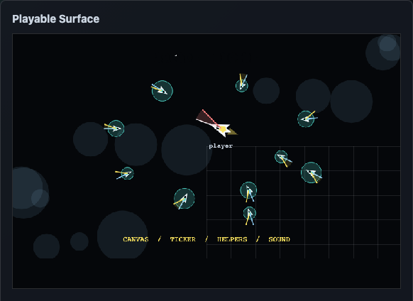
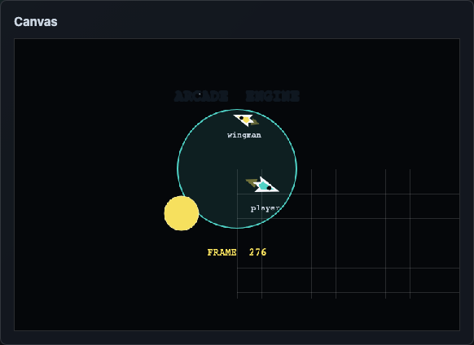
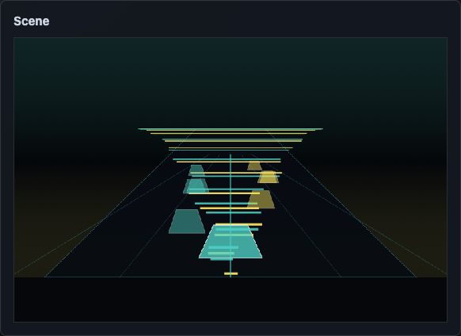
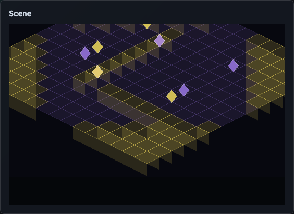
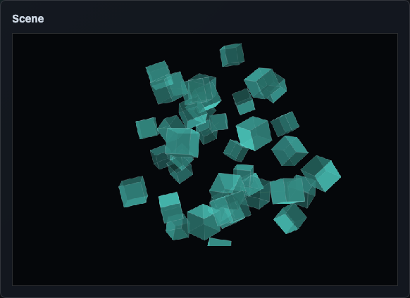
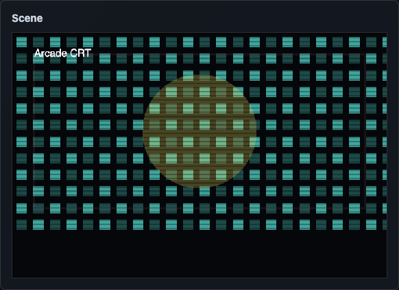
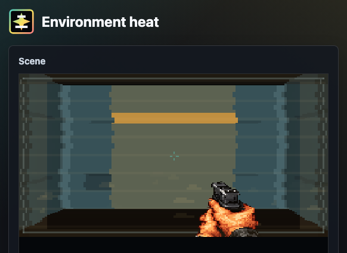
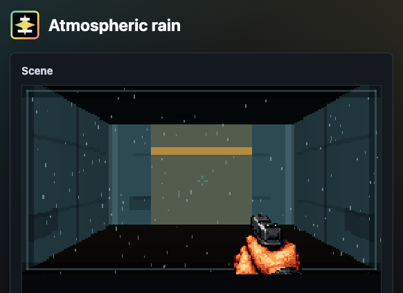
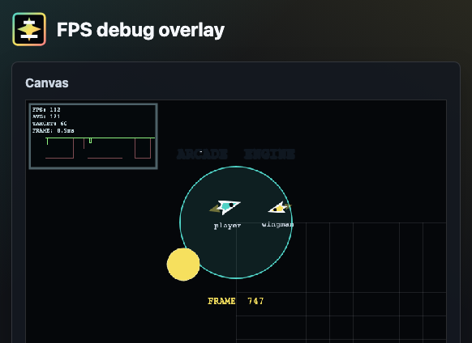

# 🕹️ Arcade Engine

A small browser arcade-game engine for canvas games, published on npm as
`arcade-engine`.

Arcade Engine is a standalone TypeScript package for arcade-style browser
games. It provides a canvas arena, timing, audio, geometry, collision,
viewport, 2.5D projection, 3D cube-cluster, and rendering helpers that are
small enough to compose in your own game loop.

Install and import the npm package as `arcade-engine`. In this repository, the
public source entry point is `src/index.ts`; published builds emit ESM
JavaScript, source maps, declaration files, and declaration maps to `dist`.
Storybook is documentation and demo output only; it builds to `storybook-static`
and is not included in the npm package output.

## 🧭 Project History

Arcade Engine began as the reusable browser-game engine code inside
[manix84/time-pilot](https://github.com/manix84/time-pilot/). It was extracted
into its own package so the canvas arena, timing, audio, input, scoring, and
helper systems could support other arcade-style browser games too.

## ✨ What It Provides

- Canvas arena creation, resizing, fullscreen handling, text, sprites, circles,
  debug grids, and asset preloading.
- RequestAnimationFrame-backed ticking with render FPS caps and fixed-step
  simulation timing.
- HTML audio playback with music/effects channels, global pause/resume/stop,
  fades, blocked-playback reporting, and optional spatial panning.
- Input action mapping helpers for keyboard, mouse, touch, pointer, and gamepad
  controls.
- Local multiplayer input helpers for player one/player two keyboard,
  mouse/touch, and assigned gamepad controls, plus backend-agnostic remote
  player intent contracts.
- Browser capability helpers for screen wake locks, fullscreen/orientation
  immersive mode, and installed-app exit fallbacks.
- User option stores with schema defaults, caller-provided normalization,
  localStorage persistence, reset behavior, subscribers, and change events.
- Runtime logger helpers with configurable log levels and console routing.
- Storage reset helpers for namespaced and score-like localStorage cleanup.
- Viewport zoom helpers for responsive UI/game scaling and manual zoom values.
- Retro display filter presets and normalization helpers for CRT, VHS, custom,
  and runtime-boosted presentation settings.
- Pixel-art screen effects for camera-surface droplets, player-state feedback,
  and environmental conditions.
- World-space atmospheric effects for rain, snow, ash, and embers, with
  optional player-relative motion.
- Procedural background starfields with player-relative x/y scrolling and
  z-axis fly-through motion.
- Canvas-rendered FPS performance overlay with target-relative graph coloring.
- Achievement state helpers for local unlocks, progress counters, and status
  lists.
- Canvas achievement notification helpers for queued unlock popups.
- High-score helpers for local leaderboards, optional remote sync, receipt
  integrity payloads, backend receipt issuance, and submission validation.
- Sprite animation helpers for frame timing and sprite-sheet frame selection.
- Math, heading, spawn, collision, area-exit, cloning, random-color, and
  browser-event helpers.
- 2D follow-camera helpers with smoothing, dead zones, and world bounds.
- Viewport scaling helpers for responsive arena bounds and debug vector drawing
  for heading and steering overlays.
- Grid helpers for board, tile, puzzle, and cell-based games.
- Axis-aligned box helpers for paddle, brick, shot, enemy, and platform-style
  movement.
- Gravity and lightweight 2D/3D ragdoll helpers for arcade physics effects.
- Canvas rendering helpers for trails, lines, polygons, hex color parsing, and
  shading.
- 2D ray tracing helpers for visibility polygons, line-segment ray hits,
  capped light bounces, and movable occluder lighting demos.
- 2.5D projection helpers for perspective lanes, isometric tiles, depth loops,
  and pseudo-3D arcade camera effects.
- Arcade motion helpers for first-person camera framing, side-scroller loops,
  jump arcs, and spatial audio pan/depth calculations.
- Spatial audio math helpers for distance gain, pan, and listener/source mixes.
- 3D cube-cluster helpers for voxel-style pickups, modular level pieces,
  plasma links, deterministic explosions, and fading debris.

## 📦 Installation

```sh
npm install arcade-engine
```

The package name is lowercase for npm compatibility. The project and
documentation use the display name Arcade Engine.

## 🚪 Package Entry

Most browser games import the pieces they need from the package root:

```ts
import {
  GameArena,
  Sound,
  Ticker,
  createInputController,
  detectBoxCollision,
  helpers,
} from "arcade-engine";
```

Backend score-validation code can import the smaller high-score subpath:

```ts
import {
  createHighScoreServerRunReceipt,
  validateHighScoreServerRunReceipt,
  validateHighScoreSubmission,
} from "arcade-engine/high-scores";
```

The package is ESM-only. Import from `arcade-engine` or a documented package
subpath such as `arcade-engine/high-scores`; do not import from individual
source files in consuming projects.

## 🚀 Quick Start

Create a host element with a stable size:

```html
<div id="game"></div>
```

```css
#game {
  width: 800px;
  height: 600px;
  background: #05070d;
}
```

Then wire an arena, ticker, and input controller:

```ts
import {
  GameArena,
  Ticker,
  createInputController,
  helpers,
} from "arcade-engine";

const host = document.querySelector("#game") as HTMLElement;
const arena = new GameArena(host, {
  defaultTextColor: "#f8fbff",
  fontFamily: "system-ui, sans-serif",
});
const input = createInputController({
  fire: ["Space", "MouseLeft", "TouchPrimary", "Gamepad0"],
  left: ["ArrowLeft", "KeyA", "GamepadAxisLeftXNegative"],
  right: ["ArrowRight", "KeyD", "GamepadAxisLeftXPositive"],
});
const ticker = new Ticker({ fixedStepFps: 60 });
const player = { heading: 90, posX: 0, posY: 0 };

input.start();
arena.setBackgroundColor("#05070d");

ticker.addSchedule(() => {
  input.updateGamepads();

  if (input.isPressed("left")) {
    player.heading = helpers.rotateTo(270, player.heading, 6);
  }

  if (input.isPressed("right")) {
    player.heading = helpers.rotateTo(90, player.heading, 6);
  }

  player.posX += Math.cos((player.heading * Math.PI) / 180) * 3;
  player.posY += Math.sin((player.heading * Math.PI) / 180) * 3;

  arena.clear();
  arena.drawCircle(player.posX, player.posY, 12, {
    backgroundColor: input.isPressed("fire") ? "#f2b84b" : "#4fd1c5",
  });
  arena.renderText("READY", 0, -260, { align: "center", size: 18 });
}, 1);

ticker.start();
```

That starter covers the usual first pieces: canvas setup, a fixed simulation
loop, keyboard/mouse/touch/gamepad input, simple movement, and drawing.

## 🖼️ Demo Screenshots

| Arcade loop | GameArena |
| --- | --- |
|  |  |

| 3D racer | Isometric room |
| --- | --- |
|  |  |

| Cube clusters | Display filters |
| --- | --- |
|  |  |

| Screen effects | Atmospheric effects |
| --- | --- |
|  |  |

| FPS debug graph |
| --- |
|  |

## 🧱 Core Modules

### 🎬 `GameArena`

`GameArena` owns a canvas inside a host element. It handles the common setup
work that most canvas games need before a loop can draw anything.

```ts
import { GameArena } from "arcade-engine";

const host = document.querySelector("#game") as HTMLElement;
const arena = new GameArena(host, {
  defaultTextColor: "#ffffff",
  fontFamily: "sans-serif",
});

arena.setBackgroundColor("#000000");
arena.clear();
arena.renderText("READY", 0, -40, {
  align: "center",
  size: 24,
});
```

Use it for canvas sizing, `CanvasRenderingContext2D` access, fullscreen
requests, asset preloading, sprite-frame drawing, crisp pixel-art rendering,
text drawing, circles, and debug grids.

### ⏱️ `Ticker`

`Ticker` schedules callbacks on `requestAnimationFrame`. Use an FPS cap when
you want to draw less often, or fixed-step timing when simulation should advance
at a stable rate regardless of render cadence.

```ts
import { Ticker } from "arcade-engine";

const ticker = new Ticker({ fixedStepFps: 50 });

ticker.addSchedule((frame) => {
  updateSimulation(frame);
}, 1);

ticker.start();
```

`new Ticker({ fps: 30 })` caps render callbacks. Fixed-step ticker options run
catch-up steps for deterministic movement and collision.

### 🔊 `Sound`

`Sound` wraps browser `Audio` elements and keeps channel volume, global mute,
pause/resume, fades, and cleanup in one place.

```ts
import { Sound } from "arcade-engine";

Sound.configure({
  getVolume: (channel) => (channel === "music" ? 0.6 : 0.8),
  onPlaybackBlocked: ({ channel, sources }) => {
    console.info("Playback blocked", channel, sources);
  },
});

const music = new Sound("/music/menu.ogg", { channel: "music" });
music.fadeInLoop(700);
```

Audio playback still follows browser rules, so games should start playback from
user gestures.

## 🧮 Helper Families

### Geometry And Events

The default `helpers` export includes:

- `float(number)` for rounding noisy decimal results.
- `rotateTo(destinationAngle, currentAngle, stepSize)` for incremental turning.
- `getSpawnCoords(target, options?)` for arc/radius spawning.
- `findHeading(target, origin?)` for angle and distance between objects.
- `detectCollision(target, origin?)` for radial collision.
- `detectAreaExit(radialCenter, target, radius)` for arena boundary checks.
- `bind(eventNames, callback, element?)` and `unbind(...eventNames)` for simple
  DOM event registration.
- `getRandomColor()` and `cloneObject(oldObject)`.

### Viewport And Debug Vectors

Viewport helpers calculate radius and scale limits from the current arena size.
Debug vectors draw velocity, heading, and target overlays so movement logic is
visible while developing.

Viewport-scale helpers separately cover manual zoom percentages and responsive
UI/game scaling from a reference viewport.

### Grid And Box Collision

Grid helpers convert between pixel coordinates and cells, clamp cells to a
board, and snap entities to a grid. Box helpers move and collide top-left
`posX`/`posY` rectangles for games like Breakout, Space Invaders, and simple
platformers.

### Achievements

Achievement helpers keep definition metadata separate from persisted state.
Games can unlock achievements, increment progress counters, and render status
lists from the returned data. See the `Engine/Systems/Achievements/Achievements`
Storybook story for an interactive unlock/progress example.

### Achievement Notifications

Achievement notification helpers render queued unlock popups to a canvas
context. Games provide the achievement text, optional icon frame, viewport, and
render loop; the renderer owns queue timing, slide/hold/exit animation, text
wrapping, and placeholder icons.

See the `Engine/Systems/Achievements/Achievement Notifications` Storybook story
for a popup queue demo.

### High Scores

High-score helpers support local score tables and optional remote sync. Games
provide their own storage key, default scores, API path, settings
normalizers, and plausibility rules. See the
`Engine/Systems/Player Data/High Scores` Storybook story for local leaderboard,
threshold, integrity, and plausibility examples.

Remote leaderboard submissions can use run receipts and integrity payloads.
Backends can import `createHighScoreServerRunReceipt`,
`validateHighScoreServerRunReceipt`, and `validateHighScoreSubmission` from
`arcade-engine/high-scores`, while keeping route handling, receipt storage, and
rate limits app-owned.

### User Options

User option stores keep game-specific settings schemas outside the engine while
providing reusable persistence mechanics. Games provide defaults, optional
normalization, and a storage key; the store handles localStorage access,
best-effort writes, reset, subscriptions, and optional DOM change events.

See the `Engine/Systems/Player Data/User Options` Storybook story for a live
options-store example.

### Runtime Utilities

Runtime utility helpers cover common app-service behavior that games usually
wire into debug menus: configurable log levels, prefixed console logging,
best-effort localStorage access, namespaced storage cleanup, score-key cleanup,
and manual zoom normalization.

### Browser Capabilities

Browser capability helpers wrap optional PWA APIs behind best-effort helpers.
Use `ScreenWakeLockController` for screen wake locks,
`enterImmersiveMode()` for trusted-click fullscreen/orientation requests, and
`exitInstalledApp()` when an installed app should attempt to close and report a
blocked exit.

### Display Filters

Display filter helpers provide reusable retro presentation presets and
normalization math. Use them to offer CRT/VHS/custom settings menus, clamp
untrusted stored intensities, and layer temporary runtime boosts into effective
filter settings.

See the `Engine/Systems/Presentation/Display Filters` Storybook story for a
visual preset demo.

### Screen Effects

Screen-effect helpers provide reusable Canvas 2D overlay layers for temporary
player and environment feedback. `ScreenEffectManager` registers effect
definitions, enables or disables them by id, fades intensity values, updates
active effects, and renders them in priority order.

```ts
const effects = new ScreenEffectManager();

effects.enable("screen-low-health", { intensity: 0.75 });
effects.enable("environment-heat", { intensity: 0.35, priority: 5 });

effects.update(deltaTime, { width: canvas.width, height: canvas.height });
effects.render(context, { width: canvas.width, height: canvas.height });
```

The built-in `screen-droplets` effect uses pooled pixel-snapped rectangles for
rain on a camera lens or visor. See the
`Engine/Systems/Player Effects/ScreenDroplets` Storybook story for the live
demo.

Player effects include screen droplets, fire, frost, low health, poison, shock,
and speed boost. Environment screen effects include heat, frost, fire, and
underwater. The environment demos use a reusable pixel-art FPS corridor
background with a fixed HUD weapon asset so effect layering can be judged
against a readable game scene.

Atmospheric effects live in `atmospheric-effects.ts` and render between the game
world and HUD/screen overlays. Use `createAtmosphericRainEffect`,
`createAtmosphericSnowEffect`, or `createAtmosphericAshEmberEffect` when the
player should feel inside rain, snow, ash, or embers rather than looking through
a wet or damaged camera surface. Pass `playerMotion: { enabled: true, ... }` or
call `setPlayerMotion()` when the particles should react to player velocity,
forward movement, or turning.

### Background Stars

`ProceduralStarfield` renders generated stars as a background prop layer. It is
useful for space, sky, or fast-travel scenes where background objects should
move opposite player x/y motion and also expand away from, or contract toward,
the screen centre for faux z-axis movement.

```ts
const stars = createProceduralStarfield({
  starCount: 160,
  velocityX: playerVelocity.x,
  velocityY: playerVelocity.y,
  velocityZ: playerVelocity.z,
});

stars.update(deltaTime, { width: canvas.width, height: canvas.height });
stars.render(context, { width: canvas.width, height: canvas.height });
```

### Debug Overlay

`GameArena` can render a Canvas 2D FPS debug overlay after the game scene. It is
backed by `PerformanceSampler` and `FpsOverlay`, supports minimal, basic,
detailed, and graph views, and colors the graph relative to the configured
target FPS so 30 FPS can be healthy for a 30 FPS game but poor for a 144 FPS
target.

```ts
const arena = new GameArena(host, {
  debug: {
    fps: {
      enabled: true,
      level: "graph",
      targetFps: 60,
    },
  },
});

arena.renderDebugOverlay(deltaMs);
```

### Canvas Rendering

Canvas rendering helpers are small drawing utilities used by the demos and
available to games:

- `fillCanvasWithTrail(context, canvas, color, trailOpacity)` clears or fades a
  frame while leaving after-images.
- `drawCanvasLine(context, from, to, color, width?)`.
- `drawCanvasPolygon(context, points, color, stroke?)`.
- `parseHexColor`, `colorWithAlpha`, and `shadeHexColor` for hex color work.

`fillCanvasWithTrail` accepts any valid CSS color string. Hex-specific helpers
require 3 or 6 digit hex colors.

### Ray Tracing

Ray tracing helpers calculate 2D visibility polygons from a light or viewpoint
against rectangular bounds and polygon occluders:

- `createRayTracingRectangle(x, y, width, height)`.
- `createRayTracingBoundsPolygon(bounds)`.
- `getRayTracingPolygonSegments(polygon)`.
- `getRayTracingSegments(bounds, occluders?)`.
- `traceRay(origin, angle, segments)`.
- `traceVisibilityPolygon(origin, bounds, occluders?)`.
- `traceLightBounces(origin, bounds, occluders?, options?)`.

Use them for Canvas 2D lighting, line-of-sight, fog-of-war, stealth vision
cones, or visibility previews. Bounds and occluders can provide surface colors
so bounced layers pick up material tint. See the
`Engine/Systems/Presentation/Ray Traced Apartment` Storybook story for
draggable furniture, a movable lamp, separate light-intensity controls, one
low-reflectivity bounce enabled by default, a bounce attenuation control, a
ray-guide toggle, and monochrome TV-static flicker.

### 2.5D Projection

The `arcade-3d` helpers are renderer-agnostic math functions for arcade-style
depth effects:

- `projectPerspectivePoint(point, viewport, options?)`.
- `projectIsometricPoint(point, options?)`.
- `getPerspectiveScale(depth, options?)`.
- `getLoopedDepth(options)` and `wrapDepth(depth, range)`.
- `getDepthProgress(depth, range)`.
- `getIsometricTileCorners(center, options?)`.
- `getIsometricWallSide(tileCorners, height, side?)`.

These helpers do not require WebGL. They are useful for pseudo-3D racing,
starfields, first-person lanes, isometric rooms, 2.5D side scrollers, and
layered arcade scenes drawn to a normal canvas.

### 🏃 Arcade Motion

Arcade motion helpers move common demo math into the engine package:

- `getFirstPersonCamera(viewport, options?)` calculates center and horizon
  framing from viewport size, look input, and optional bobbing.
- `getLoopedScrollerPosition(options)` wraps side-scroller scenery and platform
  positions across a repeat range.
- `getSideScrollerActorPosition(options)` wraps obstacles, enemies, pickups, or
  platforms and reports visibility/progress for rendering and collision checks.
- `getSideScrollerJumpY(options)` calculates a simple jump/bob arc.
- `getSpatialAudioPan(options)` clamps source position into browser pan range.
- `getSpatialAudioDepth(options)` turns source distance into a visual depth
  value for 2.5D audio scenes.

### 🧊 3D Cube Clusters

Cube clusters describe block models as data rather than binding the engine to a
specific renderer.

```ts
import {
  centerCubeCluster,
  createCubeClusterFromPattern,
  createExplosionBlocks,
  stepExplosionBlocks,
} from "arcade-engine";

const pickup = createCubeClusterFromPattern(
  [
    [" ### ", "#####", " ### "],
    ["  #  ", " ### ", "  #  "],
  ],
  { color: "#4fd1c5", gap: 0.2, size: 1 }
);

const blocks = centerCubeCluster(pickup.blocks);
let explosion = createExplosionBlocks(blocks, { force: 7 });
explosion = stepExplosionBlocks(explosion, 1 / 60);
```

Use these helpers with Three.js, Babylon, raw WebGL, or a custom canvas
projection. The engine supplies block positions, links, bounds, centers,
normalized vectors, and explosion state; the renderer decides how to display
them.

## 📚 Storybook

Storybook contains live demos for the engine surface:

- **Overview**: animated arcade loop showcases.
- **Core**: `GameArena`, ticker behavior, viewport scaling, and debug vectors.
- **Helpers**: math, geometry, object cloning, event binding, collisions,
  rotation, spawning, and 2.5D variants.
- **Systems**: input actions, local multiplayer, user options, achievements,
  achievement notifications, high scores, display filters, sprite animation,
  follow cameras, procedural background stars, player screen effects,
  environment screen effects, atmospheric effects, ray-traced apartment
  lighting, and spatial-audio math.
- **Audio**: master controls, effects, music, spatial panning, and global
  playback behavior.
- **3D**: cube-cluster pickups and modular level pieces.
- **Demos**: arcade camera styles, including racer, starfighter, isometric,
  hyperspace, first-person, 2D side scroller, and 2.5D side scroller examples.

Run it locally:

```sh
npm run storybook
```

Build the static docs:

```sh
npm run build:storybook
```

More local documentation is available in:

- [src/README.md](src/README.md)
- [src/stories/README.md](src/stories/README.md)
- [src/stories/helpers/README.md](src/stories/helpers/README.md)
- [src/stories/systems/README.md](src/stories/systems/README.md)
- [src/stories/sound/README.md](src/stories/sound/README.md)
- [src/stories/ticker/README.md](src/stories/ticker/README.md)

## 🛠️ Local Development

Install dependencies:

```sh
npm install
```

Run the main checks:

```sh
npm run lint
npm run typecheck
npm test
npm run build
```

Preview the npm tarball contents:

```sh
npm run pack:dry-run
```

Build the release tarball locally:

```sh
npm run pack:release
```

Release publishing is handled by GitHub Actions when a release commit is pushed
to `main`. The workflow publishes `arcade-engine` to npmjs, publishes
`@manix84/arcade-engine` to GitHub Packages, and uploads the release tarball to
the GitHub Release for the package version. See [RELEASE.md](RELEASE.md) for
the release process and npm trusted publishing setup.

Story changes should also run:

```sh
npm run build:storybook
```

## 🧪 Tests

The test suite uses Vitest with jsdom and lightweight browser API shims for
canvas, media elements, animation frames, and storage.

Coverage includes package imports, arena behavior, viewport calculations, grid
and box helpers, input and multiplayer helpers, screen effects, atmospheric
effects, procedural background stars, FPS performance overlays, 2.5D projection
math, cube clusters, achievements, high scores, debug vectors, ticker
scheduling, sound lifecycle, and helper math/events.

## 🗺️ Package Modules

Active package modules:

- `src/index.ts`
- `src/arena.ts`
- `src/Ticker.ts`
- `src/Sound.ts`
- `src/input.ts`
- `src/multiplayer.ts`
- `src/browser-capabilities.ts`
- `src/user-options.ts`
- `src/runtime-logger.ts`
- `src/storage-reset.ts`
- `src/viewport-scale.ts`
- `src/display-filters.ts`
- `src/background-stars.ts`
- `src/screen-effects.ts`
- `src/atmospheric-effects.ts`
- `src/debug/FpsOverlay.ts`
- `src/debug/PerformanceSampler.ts`
- `src/debug/types.ts`
- `src/achievements.ts`
- `src/achievement-notifications.ts`
- `src/high-scores.ts`
- `src/animation.ts`
- `src/camera.ts`
- `src/helpers.ts`
- `src/viewport.ts`
- `src/debug-vectors.ts`
- `src/grid.ts`
- `src/box-collision.ts`
- `src/physics.ts`
- `src/canvas-rendering.ts`
- `src/arcade-3d.ts`
- `src/arcade-motion.ts`
- `src/spatial-audio.ts`
- `src/cube-cluster.ts`
- `src/types.ts`

## 🤝 Project Docs

- [📘 API Reference](API.md)
- [📦 Release Process](RELEASE.md)
- [🗒️ What's New](WHATSNEW.md)
- [🗺️ Package Roadmap](ROADMAP.md)
- [🔐 Privacy](PRIVACY.md)
- [⚖️ Licence](LICENSE.md)
- [🤝 Contributing](CONTRIBUTING.md)
- [🛡️ Security](SECURITY.md)
- [💬 Support](SUPPORT.md)
